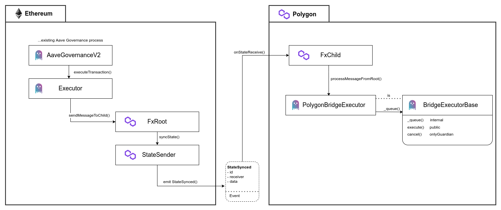
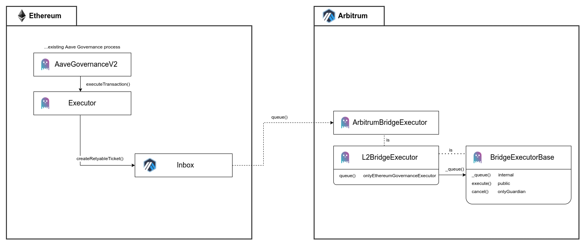
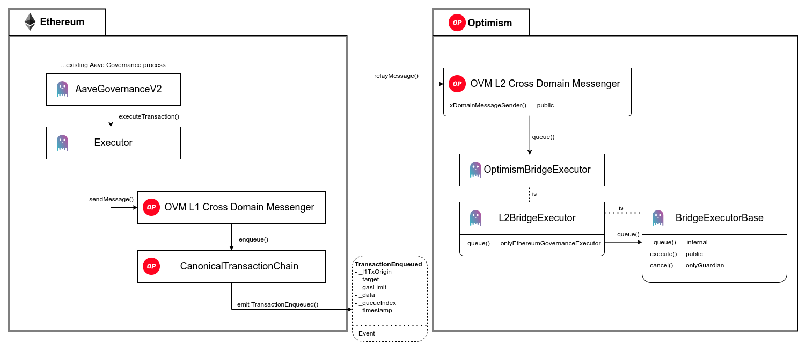

Aave governance for extensibility of drone governance on Optimism and Arbitrum: We are using Aave cross chain bridges to extend drone governance to other blockchain networks like Optimism and Arbitrum. 

Please visit https://github.com/seetadev/EthOps/tree/main/Drone-robotics-governance

Governance of Drones and UAVs using Aragon Plugins: A decentralized survey for drone ratings by users using a governance solution built with Aragon plugins at the core is done at key intervals and its onchain voting snapshots enable credibility of ratings. We can enable our smart contracts read the storage of any contract at a given block. This enables on-chain voting, airdrops on Ethereum and Polygon. Please visit https://github.com/seetadev/EthOps/tree/main/Drone-Survey-Ratings and https://github.com/seetadev/EthOps/tree/main/Drone-robotics-governance

We are using Optimistic rollup technology to enable scaling of the decentralized public goods mobility network and effective management and communication setup for Drones utilized in Operations and Maintenance across multiple regions. Drones can be effectively utilized for building operations, inspection and maintenance and safer and more efficient surveys.

Please visit the Optimism faucet configuration screenshots: https://drive.google.com/drive/folders/1ZJQc1qsTT0DA7haYnA0lG2w-lH_iSUAs

Please visit the github link at https://github.com/seetadev/EthOps/tree/main/Module3/drones-scaling-multi-regions


# Aave Governance Cross-Chain Bridges

This repository contains smart contracts and related code for Aave cross-chain bridge executors. This is intended to extend Aave Governance on Ethereum to other networks. This repository currently contains contracts to support bridging to Polygon, Arbitrum and Optimism.

The core contract is the `BridgeExecutorBase`, an abstract contract that contains the logic to facilitate the queueing, delay, and execution of sets of actions on downstream networks. This base contract needs to be extended with the functionality required for cross-chain transactions on a specific downstream network.

The `BridgeExecutorBase` contract is implemented to facilitate the execution of arbitrary actions after governance approval on Ethereum. Once the Ethereum proposal is executed, a cross-chain transaction can queue sets of actions for execution on the downstream chain. Once queued, these actions cannot be executed until a certain `delay` has passed, though a specified (potentially zero) `guardian` address has the power to cancel the execution of these actions. If the delay period passes and the actions are not cancelled, the actions can be executed during the `grace period` time window by anyone on the downstream chain.

The `BridgeExecutorBase` is abstract and intentionally leaves the `_queue` function internal. This requires another contract to extend the `BridgeExecutorBase` to handle network specific logic, cross-chain transaction validation, and permissioning, prior to calling the internal `_queue` function.

The `L2BridgeExecutor` abstract contract extends `BridgeExecutorBase` in order to make it ready for Layer 2 networks. It stores the address of the `Ethereum Governance Executor` on the Ethereum network, so each inheriting L2 implementation is aware of the address it should accept transactions from.

## Audits

- [MixBytes (12/08/21)](./audits/12-08-2021_MixBytes_AaveGovernanceCrosschainBridges.pdf)

## Getting Started

### Setup

- Clone the repository
- run `npm install`

Follow the next steps to setup the repository:

- Install `docker` and `docker-compose`
- Create an environment file named `.env` and fill out the environment variables per `example.env`

### Running in Docker

Terminal Window 1: `docker-compose up`

Once Terminal Window 1 Loaded - in a separate terminal window - Terminal Window 2:
`docker-compose exec contracts-env bash`

In Terminal Window 2, run desired scripts from npm package file (i.e `npm run compile`)

### Compile

`npm run compile`

This will compile the available smart contracts.

### Test

`npm run test`

Run the full suite of unit tests.

`npm run test-fork`

Run an end to end test of these contracts on an Ethereum mainnet fork. This makes the assumption that all contracts are on Ethereum, which is an inaccurate assumption but helps for testing smart contract functionality in one script.

### Coverage

`npm run coverage`

Get the coverage report.

## Polygon Governance Bridge

### Polygon Governance Bridge Architecture



Additional documentation around the Polygon Bridging setup can be found at the links below:

- [Polygon Docs `L1<>L2 Communication`](https://docs.polygon.technology/docs/develop/l1-l2-communication/fx-portal)
- [FxPortal](https://github.com/fx-portal/fx-portal)

### Bridge Contracts Functionality

- The proposal is an encoded function call to the function `sendMessageToChild()` in `FxRoot`. The calldata for this proposal contains two encoded variables:
  - The first variable is the address of the contract that will decode and process this message on the Polygon chain. In this case, the receiver is the `PolygonBridgeExecutor` contract address.
  - The second variable is the data that will be decoded on the Polygon chain. This field contains encoded bytes for the following fields: `targets[]`, `values[]`, `signatures[]`, `calldatas[]`, and `withDelegatecall[]`.
- When the proposal is executed, `sendMessageToChild()` in the `FxRoot` triggers `syncState()` on the `StateSender` contract which emits a `StateSync` event.
- Validators listening for this `StateSync` event then trigger the `onStateReceived()` in the `FxChild` contract on Polygon.
- In `onStateReceived` the encoded data is passed along to a contract that implements the function `processMessageFromRoot` - which in this case is in the `PolygonBridgeExecutor` contract. In `processMessageFromRoot` the `PolygonBridgeExecutor` calls `_queue()` in the `BridgeExecutorBase` contract to queue the proposed actions for the appropriate execution time

### Deploying the PolygonBridgeExecutor

- `fxRootSender` - the address that can send messages to this `PolygonBridgeExecutor` through the FxPortal. This should be the Aave Governance Executor.
- `fxChild` - the fxChild contract from the FxPortal
- `delay` - the time required to pass after the ActionsSet is queued, before execution
- `gracePeriod` - once execution time passes, you can execute this until the grace period ends
- `minimumDelay` - minimum allowed delay
- `maximumDelay` - maximum allowed delay
- `guardian` - the admin address of this contract with the permission to cancel ActionsSets

### PolygonBridge - FxPortal

This repository uses the [FxPortal](https://github.com/fx-portal/contracts) developed and designed by the Polygon team to support bridging from Ethereum to Polygon. The intent of the FxPortal is to help users avoid the step of registering their own sender and receiver contracts within Polygon's `StateSender` contract. The FxPortal contains two contracts - `FxRoot` and `FxChild`. The `FxRoot` contract has been deployed on Ethereum and the `FxChild` contract has been deployed on Polygon. The `FxRoot` contract is mapped to the `FxChild` contract via Polygon's `StateSender` contract on Ethereum. By calling the `sendMessageToChild(address _receiver, bytes calldata _data)` function in the `FxRoot`, the `msg.sender` is encoded, along with the provided `_receiver` and `_data`. This encoded message is sent to the `StateSender` contract and a `StateSynced` event is emitted with this data.

Polygon validators listen for `StateSynced` events from the `StateSender` - upon identifying one of these events from the `FxRoot`, they will call the function `onStateReceive(uint256 stateId, bytes calldata _data)` in `FxChild`. The encoded `data` message is decoded in `FxChild` and forwarded to the `receiver` contract via the function `processMessageFromRoot(stateId, rootMessageSender, data)`. The `rootMessageSender` that is passed along is the original `msg.sender` that called `FxRoot` which in this case is the Aave Governance Executor contract.

The `PolygonBridgeExecutor` implements the function `processMessageFromRoot(stateId, rootMessageSender, data);`. In this function, requiring that the `msg.sender` is the `FxChild` should ensure this is a legitimate transaction stemming from the Ethereum bridge. By confirming that the `rootMessageSender` is the Aave Governance Executor contract, the `PolygonBridgeExecutor` can conclude this bridge transaction was triggered by the Aave Governance process and should in fact be queued for execution.

### Examples of Upgradability

**Polygon Protocol Ownership Change**

In order to change the ownership of the Aave Polygon Market, the current owner must call `transferOwnership(address)` on Ownable contracts within the protocol. The address parameter provided to `transferOwnership(address)` should be the address of the deployed PolygonBridgeExecutor contract on Polygon. Once ownership of the Aave Polygon Market contracts is transferred to the PolygonBridgeExecutor, the PolygonBridgeExecutor will have the authorization to make updates to the Aave Polygon Market. Updates are only possible if they have completed the end-to-end, cross-chain governance process, passing Aave governance on Ethereum and going through the timelock on Polygon without being cancelled.

In the future, if a change is needed in the PolygonBridgeExecutor contract, a new version can be deployed, and `transferOwnership(address)` should be called on Ownable contracts within the Aave Polygon Market, through the original version of the PolygonBridgeExecutor contract in order to pass ownership to the new PolygonBridgeExecutor version.

**Aave Governance Executor Update**

Aave's governance contracts on Ethereum are upgradable and because the PolygonBridgeExecutor is dependent on knowing the address of the Aave Governance Executor contract on Ethereum, the PolygonBridgeExecutor will also have to be updated as part of this upgrade.

In order to update the PolygonBridgeExecutor - the function `updateFxRootSender(address)` should be called on the PolygonBridgeExecutor. This function should be executed via the cross-chain governance process using the original Aave Governance Executor. A proposal should be created on the Ethereum based Aave governance, once passed and executed, the transaction will be sent to the PolygonBridgeExecutor contract. Once queued and executed, the PolygonBridgeExecutor will call `updateFxRootSender(address)` on itself and update the expected Aave Governance Executor address. Once that transaction executes, the PolygonBridgeExecutor will only queue ActionsSets that originate from the new Aave Governance Executor.

## Arbitrum Governance Bridge

### Arbitrum Governance Bridge Architecture



Additional documentation around the Arbitrum Bridging setup can be found at the links below:

- [Arbitrum Docs `Messaging Between Layers`](https://developer.offchainlabs.com/docs/l1_l2_messages)
- [Inside Arbitrum `Bridging`](https://developer.offchainlabs.com/docs/inside_arbitrum#bridging)

### Arbitrum Bridge Contracts Functionality

After going through the Aave governance, the proposal payload will be a call to the following function in the Arbitrum Inbox contract on Ethereum:

```
    /**
     * @notice Put a message in the L2 inbox that can be reexecuted for some fixed amount of time if it reverts
     * @dev all msg.value will deposited to callValueRefundAddress on L2
     * @param destAddr destination L2 contract address
     * @param l2CallValue call value for retryable L2 message
     * @param  maxSubmissionCost Max gas deducted from user's L2 balance to cover base submission fee
     * @param excessFeeRefundAddress maxgas x gasprice - execution cost gets credited here on L2 balance
     * @param callValueRefundAddress l2Callvalue gets credited here on L2 if retryable txn times out or gets cancelled
     * @param maxGas Max gas deducted from user's L2 balance to cover L2 execution
     * @param gasPriceBid price bid for L2 execution
     * @param data ABI encoded data of L2 message
     * @return unique id for retryable transaction (keccak256(requestID, uint(0) )
     */
    function createRetryableTicket(
        address destAddr,
        uint256 l2CallValue,
        uint256 maxSubmissionCost,
        address excessFeeRefundAddress,
        address callValueRefundAddress,
        uint256 maxGas,
        uint256 gasPriceBid,
        bytes calldata data
    ) external payable returns (uint256)
```

From the function above, the key (non-gas related) bridging fields are `destAddr`, `data`, and `l2CallValue`. `destAddr` is the contract that will be called on Arbitrum. In this case, it is the `ArbitrumBridgeExecutor` contract. The `data` is the encoded data for the cross-chain transaction. In this case, the `data` should be the encoded data for `queue(targets, values, signatures, calldatas, withDelegatecalls)`. `l2CallValue` is what will be sent over as the `msg.value` on L2. The rest of the fields pertain to gas management on Arbitrum and should be defined per Arbitrum documentation.

When this transaction is sent cross-chain, the `msg.sender` that send the message to the Arbitrum Inbox is aliased. This means that the so-called "L2 Alias" of the Aave Governance Executor contract will be the `msg.sender` when the `ArbitrumBridgeExecutor` is called on Arbitrum. For this reason, the Aave Governance Executor contract address should be provided to the `ArbitrumBridgeExecutor` contract in the constructor. This address will be saved, transformed to its alias, and used to permit the queue function so that only calls from this address can successfully queue the ActionsSet in the `BridgeExecutorBase`.

### Deploying the ArbitrumBridgeExecutor

- `ethereumGovernanceExecutor` - the address that will have permission to queue ActionSets. This should be the Aave Governance Executor.
- `delay` - the time required to pass after the ActionsSet is queued, before execution
- `gracePeriod` - once execution time passes, you can execute this until the grace period ends
- `minimumDelay` - minimum allowed delay
- `maximumDelay` - maximum allowed delay
- `guardian` - the admin address of this contract with the permission to cancel ActionsSets

## Optimism Governance Bridge

### Optimism Governance Bridge Architecture



Additional documentation around the Optimism Bridging setup can be found at the links below:

- [Optimism Docs `Sending data between L1 and L2`](https://community.optimism.io/docs/developers/bridge/messaging/)
- [Inside Optimism `Bridging assets between layers`](https://community.optimism.io/docs/how-optimism-works/#bridging-assets-between-layers)

### Optimism Bridge Contracts Functionality

After going through the Aave governance, the proposal payload will be a call to the following function in the OVM L1 Cross Domain Messenger contract on Ethereum:

```
    /**
     * Sends a cross domain message to the target messenger.
     * @param _target Target contract address.
     * @param _message Message to send to the target.
     * @param _gasLimit Gas limit for the provided message.
     */
    function sendMessage(
        address _target,
        bytes memory _message,
        uint32 _gasLimit
    ) public
```

From the function above, the `target` is the contract that will be called on Optimism (in this case it is the `OptimismBridgeExecutor` contract). The `_message` is the encoded data for the cross-chain transaction: the encoded data for `queue(targets, values, signatures, calldatas, withDelegatecalls)`. The `_gasLimit` field pertain to gas management on Optimism and should be defined per Optimism documentation.

When this transaction is sent cross-chain, the `msg.sender` that sends the message to the Optimism Messenger is stored at the OVM L2 Cross Domain Messenger and queryable using the following function:

```
function xDomainMessageSender() external view returns (address);
```

Therefore, the `msg.sender` of the cross-chain transaction on Optimism is the OVM L2 Cross Domain Messenger contract, and the L1 sender is the Aave Governance Executor contract. For this reason, the Aave Governance Executor contract address should be provided to the `OptimismBridgeExecutor` contract in the constructor. This address will be saved and used to permit the queue function so that only calls from this address can successfully queue the ActionsSet in the `BridgeExecutorBase`.

### Deploying the OptimismBridgeExecutor

- `ovmL2CrossDomainMessenger` - the address of the OVM L2 Cross Domain Messenger contract
- `ethereumGovernanceExecutor` - the address that will have permission to queue ActionSets. This should be the Aave Governance Executor.
- `delay` - the time required to pass after the ActionsSet is queued, before execution
- `gracePeriod` - once execution time passes, you can execute this until the grace period ends
- `minimumDelay` - minimum allowed delay
- `maximumDelay` - maximum allowed delay
- `guardian` - the admin address of this contract with the permission to cancel ActionsSets

## License

[BSD-3-Clause](./LICENSE.md)
